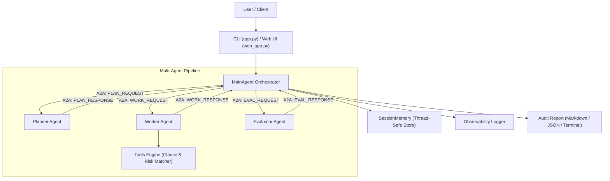

# Contract Compliance & Legal Risk Checker

An autonomous **Multi-Agent AI System** for deep contract compliance analysis, clause extraction, legal risk assessment, and audit report generation.

Built with pure Python (Zero Mandatory Dependencies), featuring **Agent-to-Agent (A2A) Messaging Protocol**, **Session Memory**, **Structured Observability**, **Interactive CLI**, and a **Zero-Dependency Web Dashboard**.

---

## Architecture Overview



---

## Key Features

1. **Multi-Agent Orchestration**:
   - **Planner Agent**: Classifies contract type (NDA, MSA, SLA, DPA, Employment, SaaS, etc.) and develops an tailored compliance checklist.
   - **Worker Agent**: Performs deep clause extraction, examines positive protections vs. red flag risks, and scores individual clauses.
   - **Evaluator Agent**: Computes composite risk levels (LOW, MEDIUM, HIGH, CRITICAL), flags critical legal exposures, and formulates actionable renegotiation advice.
2. **Standardized A2A Communication Protocol**: Structured JSON envelopes (`PLAN_REQUEST`, `WORK_REQUEST`, `EVAL_REQUEST`, responses) with UUID tracking and timestamps.
3. **Deep Legal Clause Rules**:
   - Confidentiality & Non-Disclosure (standard of care, exceptions, term)
   - Limitation of Liability (monetary caps, indirect/consequential damage exclusions)
   - Indemnification (mutual vs. unilateral, gross negligence carveouts)
   - Term & Termination (notice periods, cure periods)
   - Governing Law & Dispute Resolution (jurisdiction, arbitration)
   - Data Protection & Privacy (GDPR compliance, 72h breach notification)
   - Intellectual Property & Work-for-Hire
   - Payment Terms & Late Penalties
   - Non-Compete Restraints
   - Force Majeure & Warranties
4. **Zero Mandatory External Dependencies**: Runs instantly on standard Python 3.8+.
5. **Multiple Interfaces**:
   - **Interactive CLI** (`python app.py`)
   - **Visual Web Dashboard** (`python web_app.py`)
   - **Automated Demo** (`python run_demo.py`)
   - **Python API** (`from main_agent import MainAgent`)

---

## Quick Start

### 1. Run the Demo
```bash
python run_demo.py
```

### 2. Launch Interactive CLI
```bash
python app.py
```

### 3. Launch Web Dashboard
```bash
python web_app.py
```
Then open [http://localhost:8080](http://localhost:8080) in your browser.

---

## Project Structure

```
Contract-Compliance-Checker/
├── agents/
│   ├── __init__.py
│   ├── planner.py             # Creates tailored compliance inspection plans
│   ├── worker.py              # Executes clause extraction and deep risk scoring
│   └── evaluator.py           # Synthesizes findings and compiles audit reports
├── core/
│   ├── __init__.py
│   ├── a2a_protocol.py        # Agent-to-Agent structured communication protocol
│   ├── context_engineering.py # Payload preparation and text normalization
│   └── observability.py       # Event bus, structured logging, and audit trails
├── memory/
│   ├── __init__.py
│   └── session_memory.py      # Thread-safe session and working memory
├── tools/
│   ├── __init__.py
│   └── tools.py               # NLP/Regex clause rules, risk engines, file loaders
├── sample_contracts/          # Built-in test contracts (NDA, MSA, DPA, Employment)
├── tests/                     # 100% passing unit & integration test suite
│   ├── __init__.py
│   ├── test_tools.py
│   ├── test_agents.py
│   ├── test_memory.py
│   ├── test_protocol.py
│   └── test_main_agent.py
├── app.py                     # Interactive CLI interface
├── main_agent.py              # Master agent orchestrator
├── run_demo.py                # Automated end-to-end demo runner
├── web_app.py                 # Zero-dependency local web dashboard and REST API
├── requirements.txt           # Dependency specifications
├── setup.py                   # Python package setup
└── pyproject.toml             # Build configuration
```

---

## Running Tests

Run the complete test suite:
```bash
python -m unittest discover tests
```

---

## Python API Usage

```python
from main_agent import MainAgent

agent = MainAgent()

# Analyze raw contract text
result = agent.handle_message("""
MUTUAL NON-DISCLOSURE AGREEMENT
1. Confidential Information: Each party shall maintain proprietary info with reasonable care.
2. Term: Terminate with 30 days written notice.
3. Governing Law: State of Delaware.
""")

print("Contract Type:", result["contract_type"])
print("Risk Level:", result["meta"]["level"])
print("Risk Score:", result["meta"]["score"])
print(result["response"])

# Or analyze a contract file directly (.txt, .md, .json, .pdf, .docx)
file_result = agent.analyze_file("sample_contracts/sample_vendor_msa_risky.txt")
print(file_result["markdown_report"])
```
